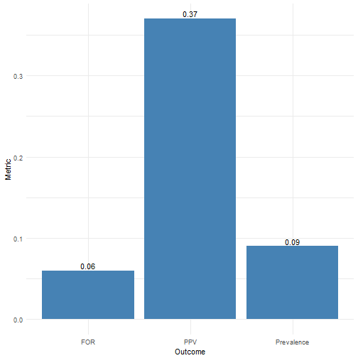

Disease Screening Application Using Shiny
========================================================
author: Mark Blackmore
date: August 30, 2017
autosize: true

Scenario
========================================================

- Suppose you take a diagnostic screening test for a particular condition or disease.

- You test is postive.  What is the probaility you have the disease?

- You test is negative.  What is the probability you have the disease?

- This Shiny application answers these questions.


Application:  User Inputs and Outputs
========================================================

User Inputs
- Prevalence:  Percent of the population that has the disease

- Sensitivity:  Detection rate of people with disease.  Also called the True Positive Rate.

- Specificity:  Detection rate of people without the disease.  Also called the True Negative Rate

Outputs
- Postive Predictive Value (PPV):  Given you a positive test result, the probability that you actually have the disease.

- False Omission Rate (FOR):  Given a negative test results, the probability that you actually have the disease.


How It Works
========================================================


```r
# Inputs
Prevalence  <- 0.09    
Sensitivity <- 0.41
Specificity <- 0.93

# Calculations & Outputs
print(PPV <- (Sensitivity * Prevalence) / ((Sensitivity * Prevalence + 
         (1 - Specificity)*(1 - Prevalence))))
```

```
[1] 0.3667992
```

```r
print(FOR <- 1 - (Specificity * (1 - Prevalence)) / ((1- Sensitivity) * Prevalence + 
         (Specificity*(1 - Prevalence))))
```

```
[1] 0.05903936
```

Output: Plot
========================================================


[Go to the App]("https://mblackmo.shinyapps.io/Disease_Testing/")
